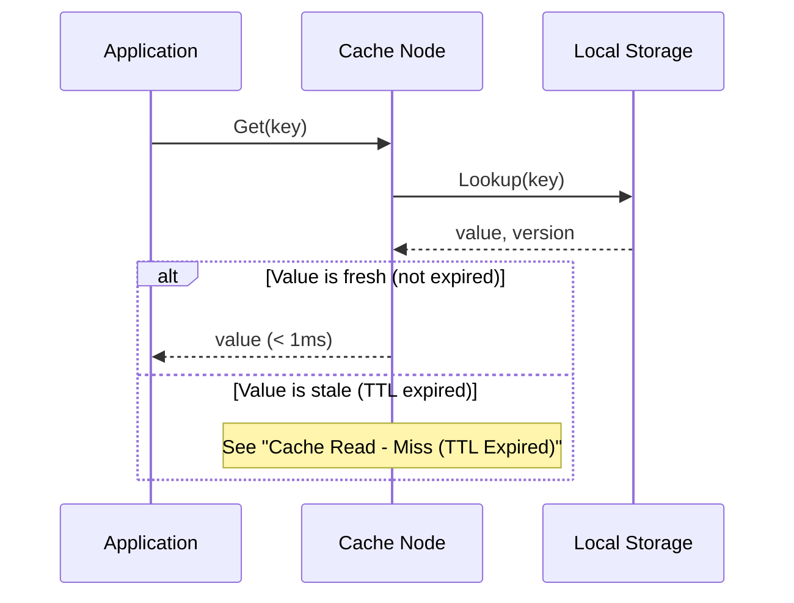
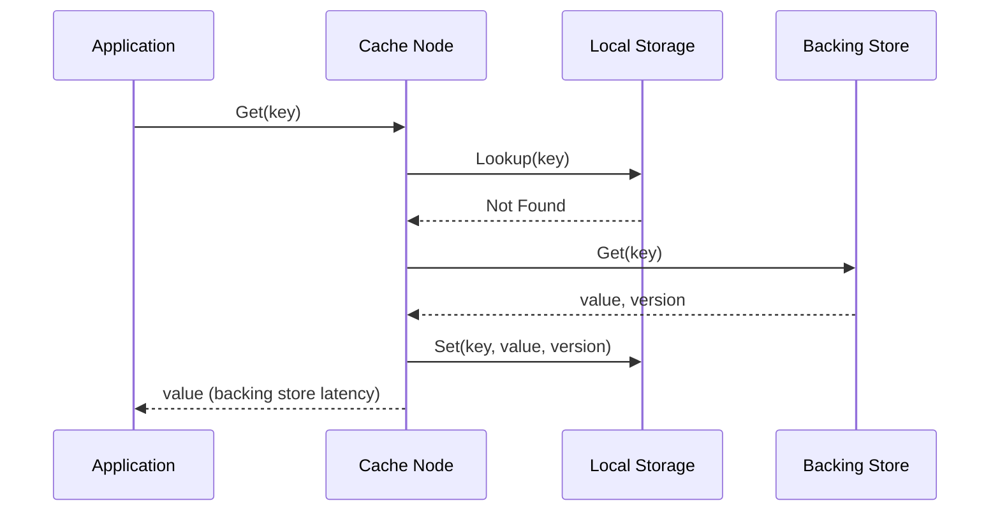
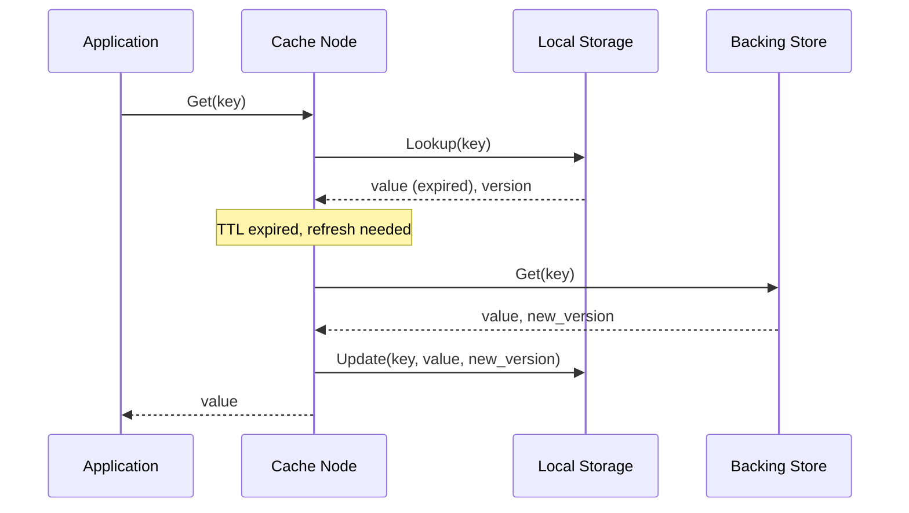
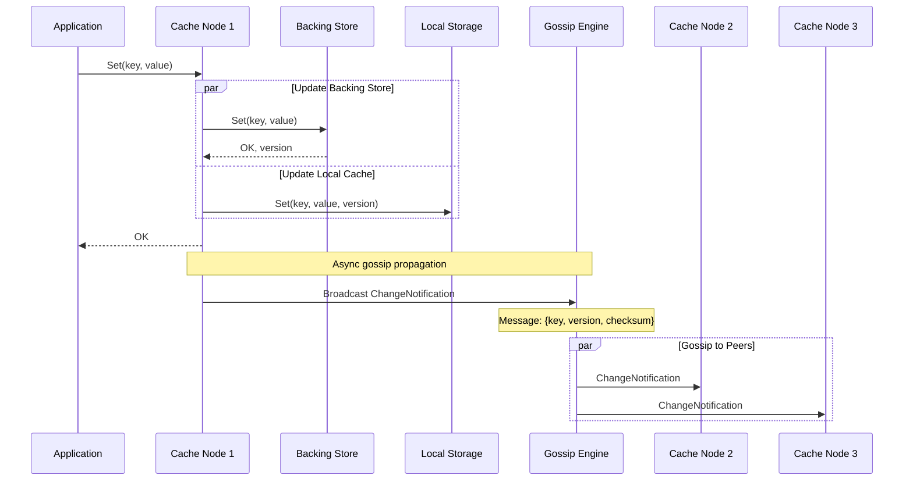
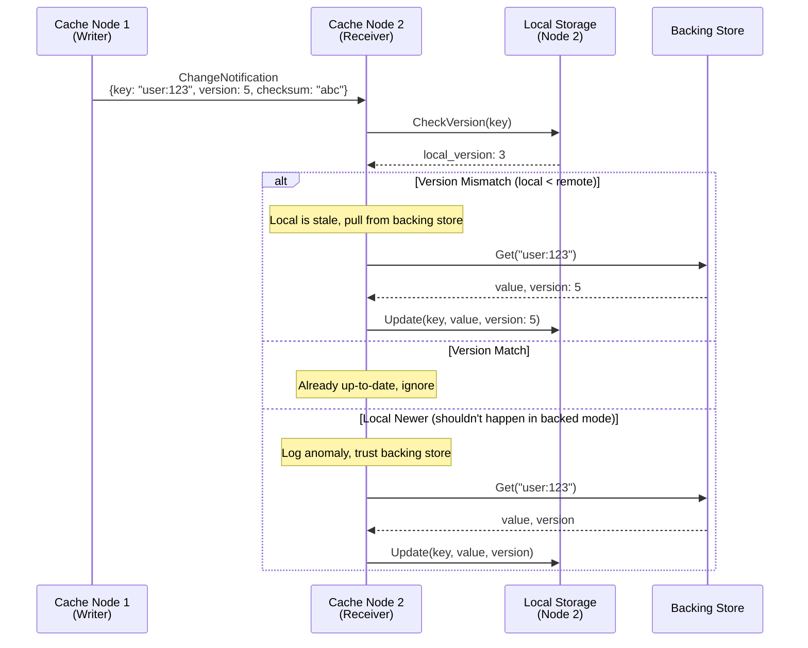
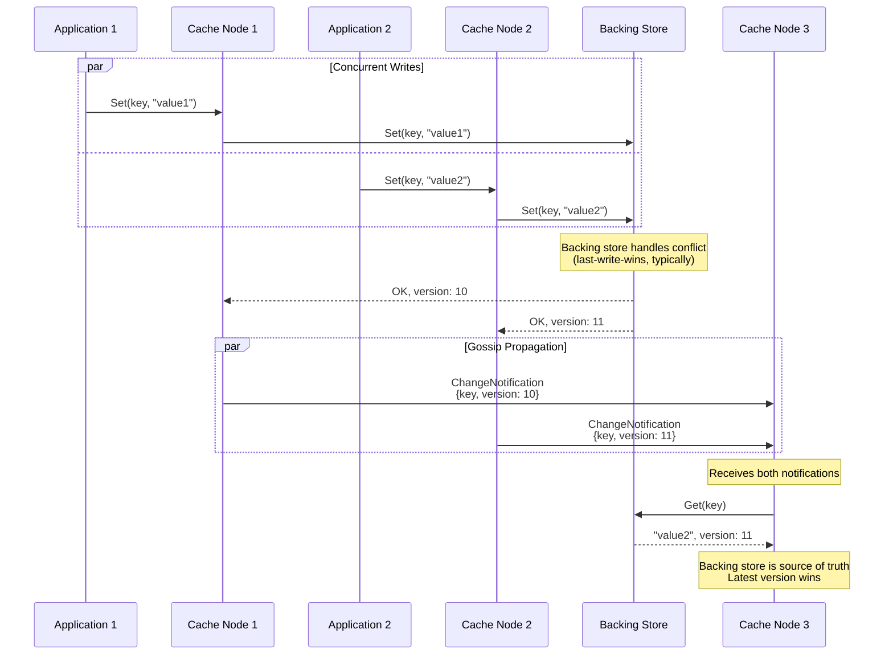
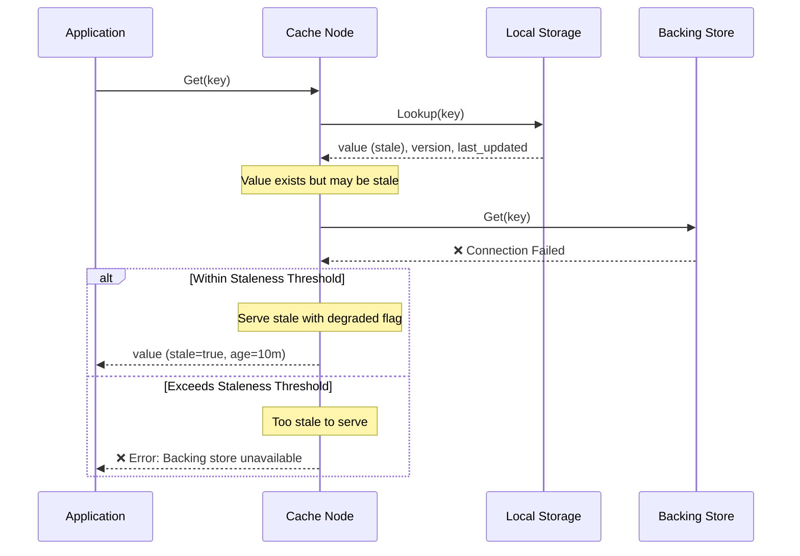
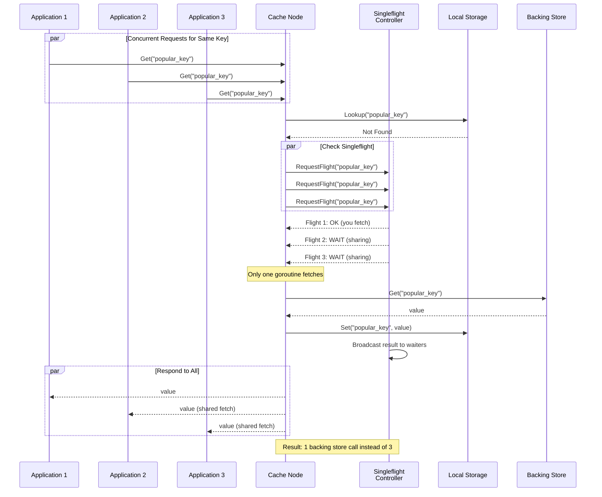
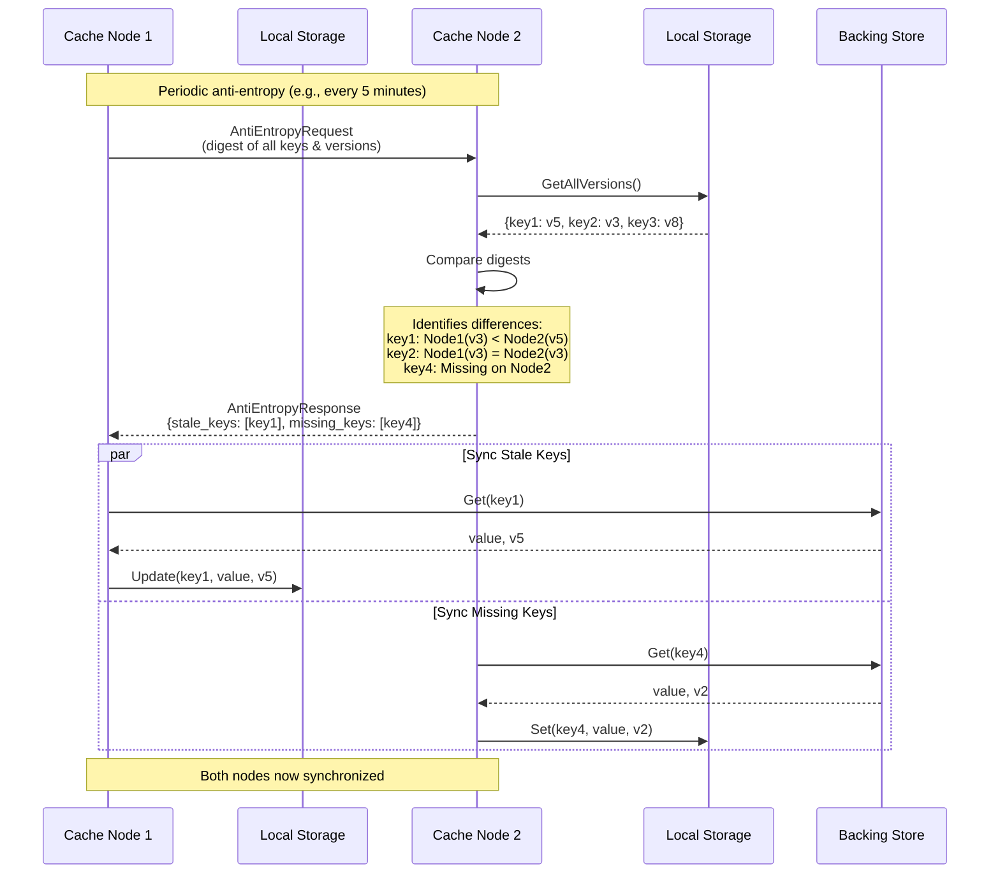
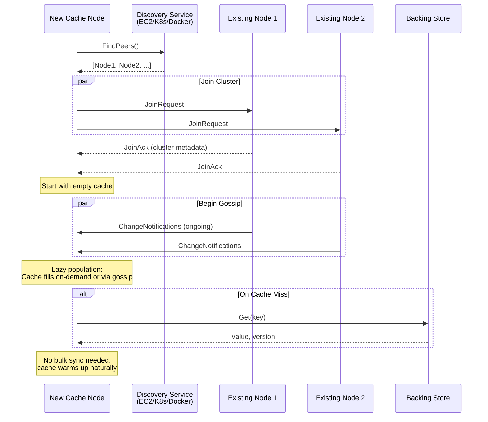

# Backed Mode Sequence Diagrams

## Overview

Backed mode uses a backing store (Redis/Valkey/Postgres) as the source of truth. Gossip protocol propagates metadata only, and nodes pull actual data from the backing store when changes are detected.

## 1. Cache Read - Hit

## 2. Cache Read - Miss (Cold Start)

## 3. Cache Read - Miss (TTL Expired)

## 4. Cache Write (Single Node)

## 5. Gossip Change Detection & Pull

## 6. Concurrent Writes (Race Condition)

## 7. Backing Store Failure - Degraded Mode

## 8. Singleflight Pattern (Thundering Herd Prevention)

## 9. Anti-Entropy Process

## 10. Node Join - Bootstrap

## Key Characteristics

**Backed Mode Trade-offs:**
- ✅ Minimal gossip bandwidth (metadata only)
- ✅ Scales to large values (gossip size constant)
- ✅ Backing store is source of truth (consistency)
- ✅ Graceful degradation (serve stale on failure)
- ⚠️ Extra network hop on cache miss/stale
- ⚠️ Dependency on backing store availability
- ⚠️ Eventual consistency (staleness window)

**Optimization Strategies:**
1. **Singleflight**: Prevent thundering herd on popular keys
2. **TTL Tuning**: Balance freshness vs backing store load
3. **Gossip Interval**: Lower interval = fresher data, higher overhead
4. **Staleness Threshold**: How long to serve stale in degraded mode
