# Independent Mode Sequence Diagrams

## Overview

Independent mode operates without a backing store. All data is stored in-memory across the cluster, and gossip protocol propagates full data (not just metadata). This mode uses vector clocks for conflict detection and resolution.

## 1. Cache Read - Hit

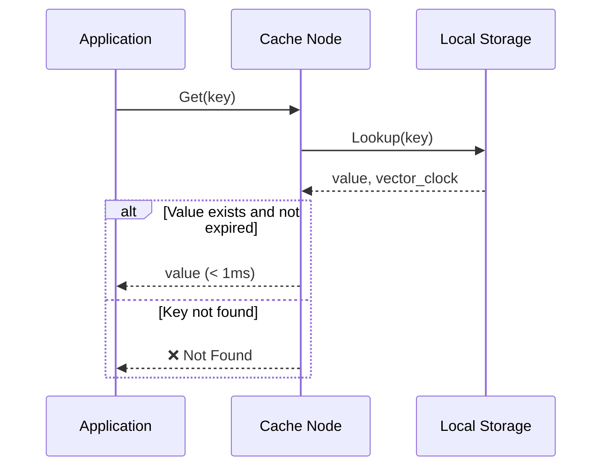

## 2. Cache Read - Miss (No Backing Store)

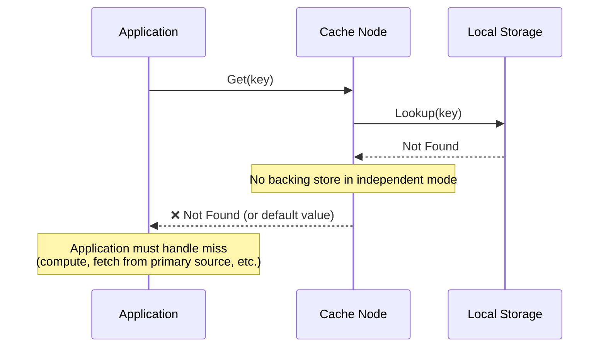

## 3. Cache Write (Single Node)

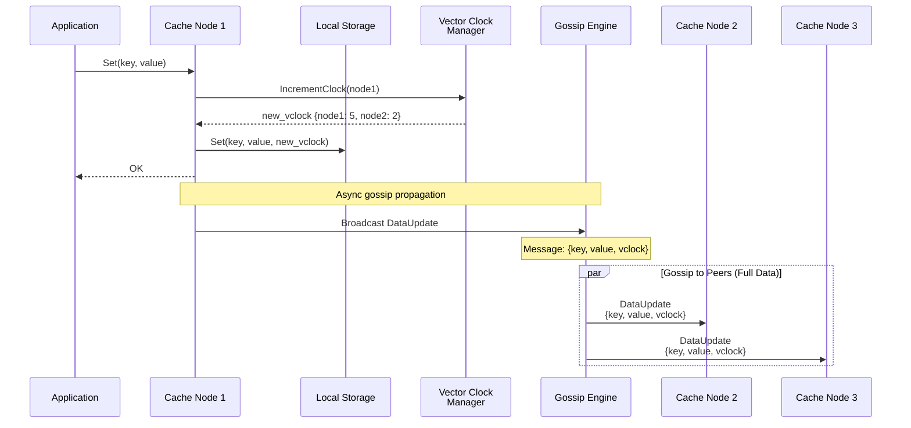

## 4. Gossip Data Propagation (No Conflicts)

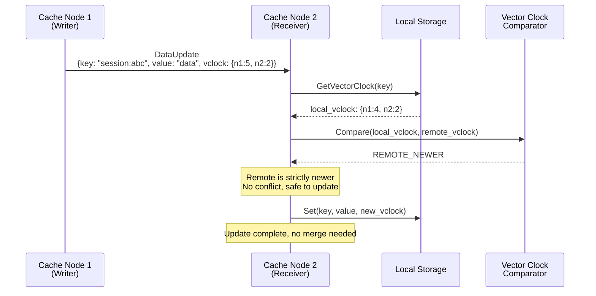

## 5. Concurrent Writes (Conflict Detection)

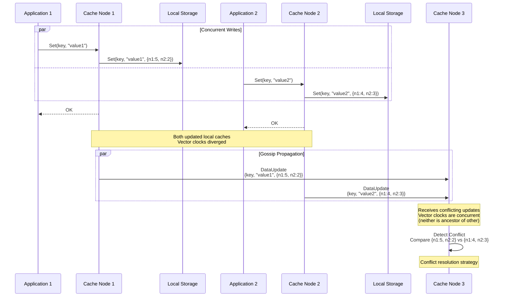

## 6. Conflict Resolution Strategies

### 6.1 Last-Write-Wins (LWW)

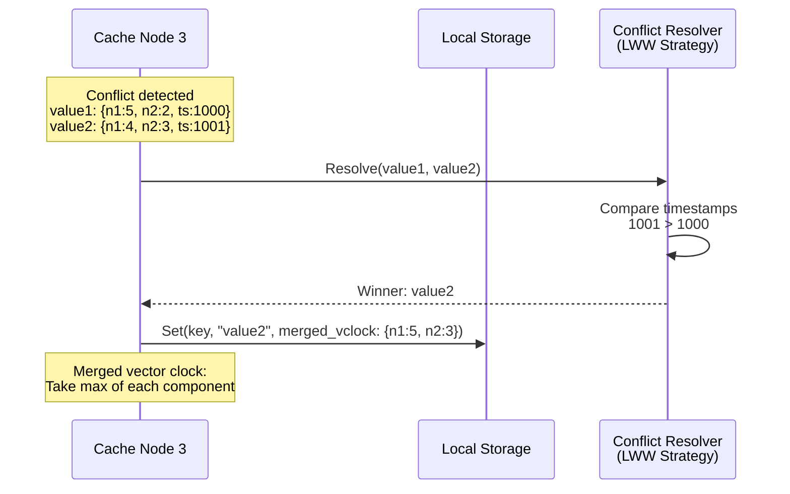

### 6.2 Custom Merge Strategy

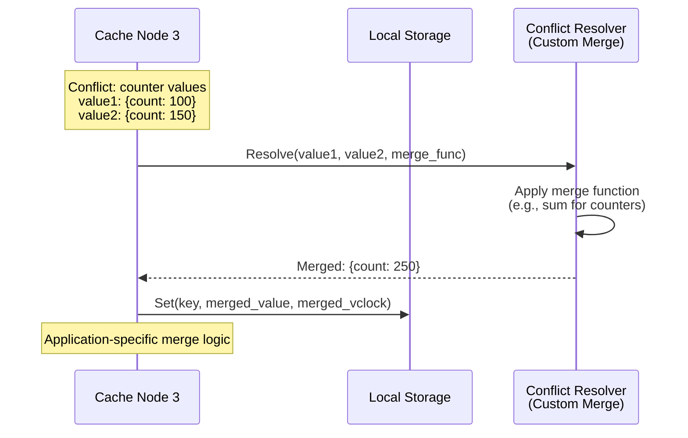

### 6.3 Keep Both (Siblings)

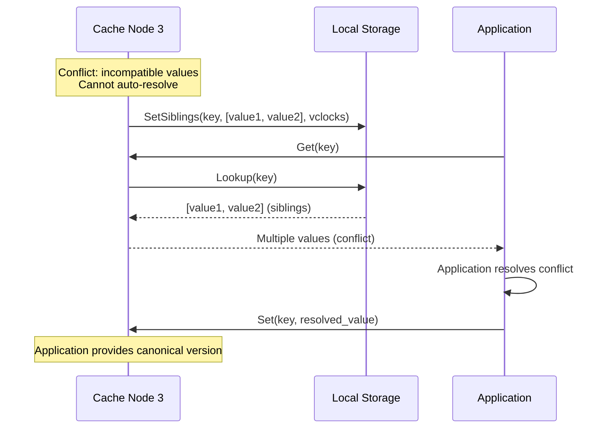

## 7. Network Partition & Healing

### 7.1 During Partition

```mermaid
sequenceDiagram
    participant Node1 as Cache Node 1<br/>(Partition A)
    participant Node2 as Cache Node 2<br/>(Partition A)
    participant Node3 as Cache Node 3<br/>(Partition B)
    participant Node4 as Cache Node 4<br/>(Partition B)

    Note over Node1,Node2,Node3,Node4: Network partition occurs

    rect rgb(255, 200, 200)
        Note over Node1,Node2: Partition A<br/>Nodes 1, 2 can communicate
    end

    rect rgb(200, 200, 255)
        Note over Node3,Node4: Partition B<br/>Nodes 3, 4 can communicate
    end

    par Operations in Partition A
        Node1->>Node1: Set(key, "valueA")
        Node1->>Node2: Gossip update
    and Operations in Partition B
        Node3->>Node3: Set(key, "valueB")
        Node3->>Node4: Gossip update
    end

    Note over Node1,Node4: Partitions operate independently<br/>Divergent state accumulates
```

### 7.2 Partition Healing

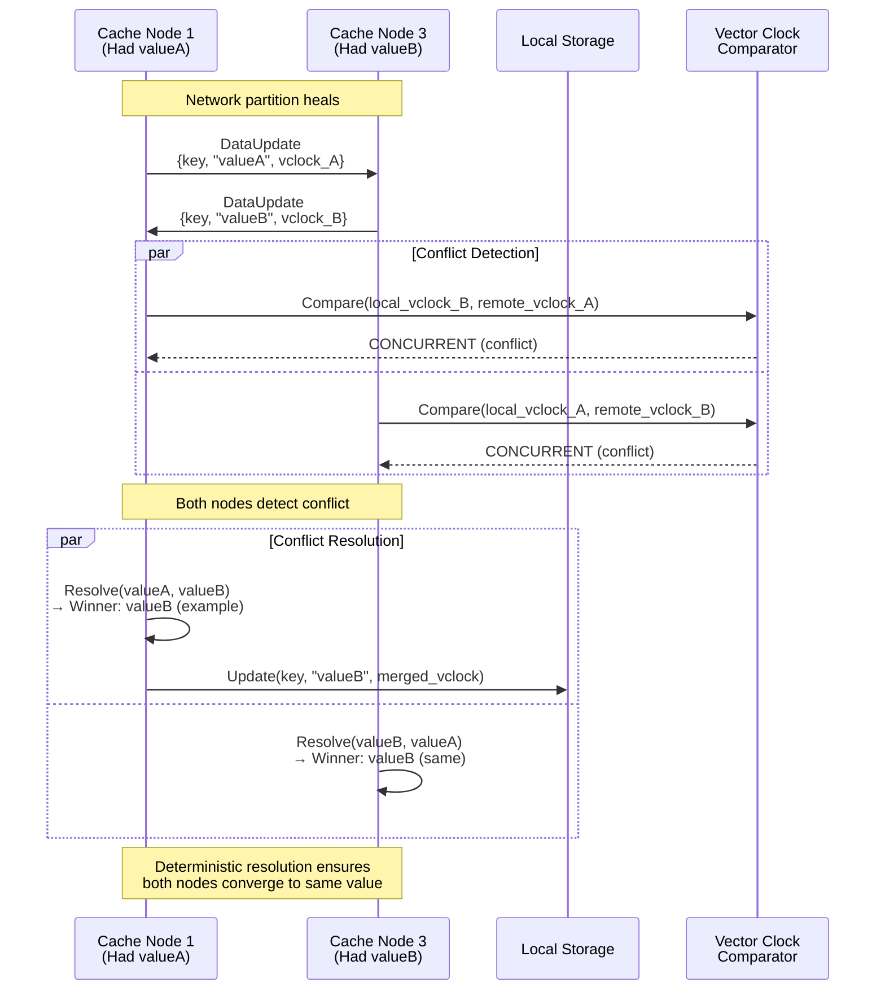

## 8. Anti-Entropy Process

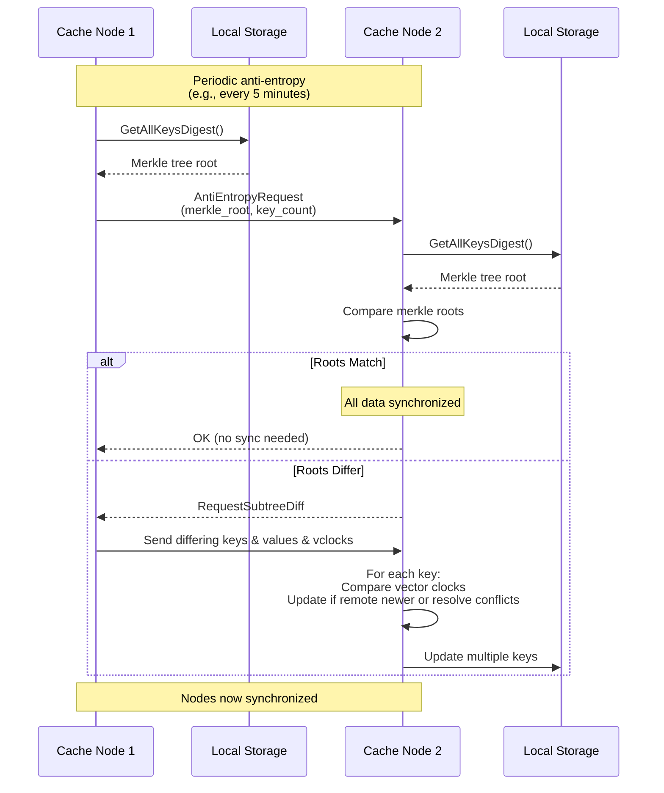

## 9. Node Join - Cluster Bootstrap

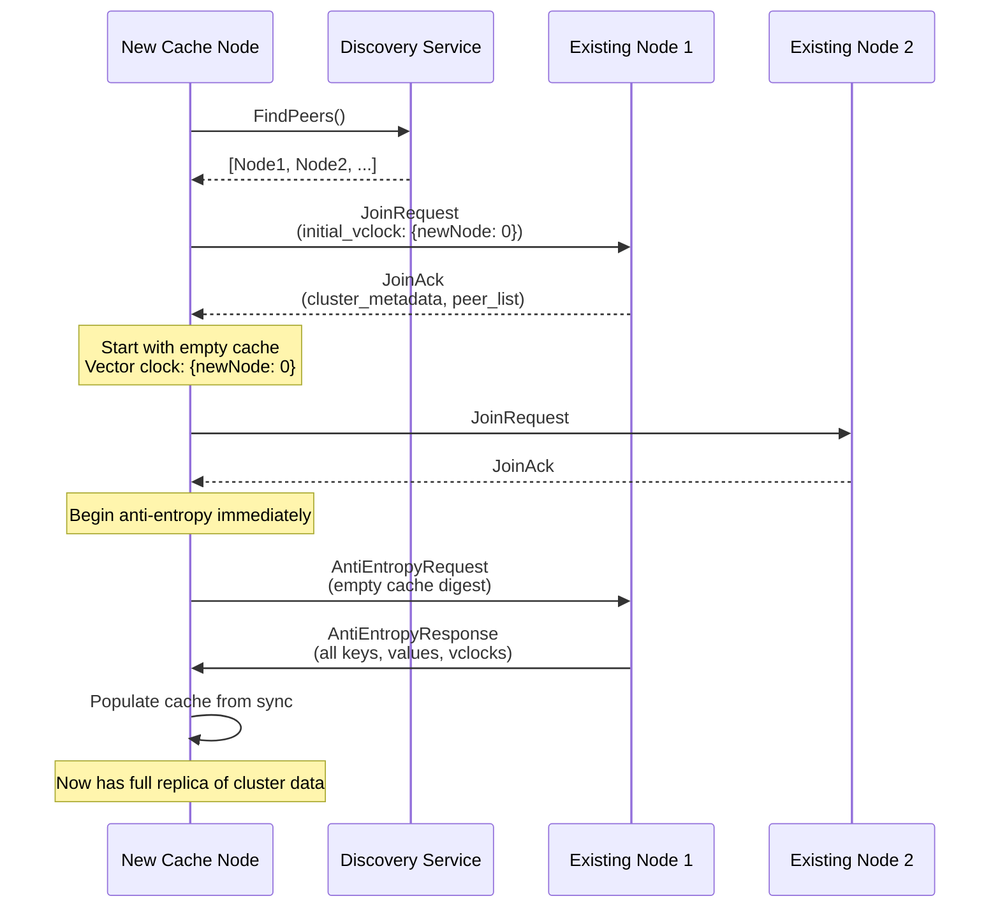

## 10. Node Failure & Recovery

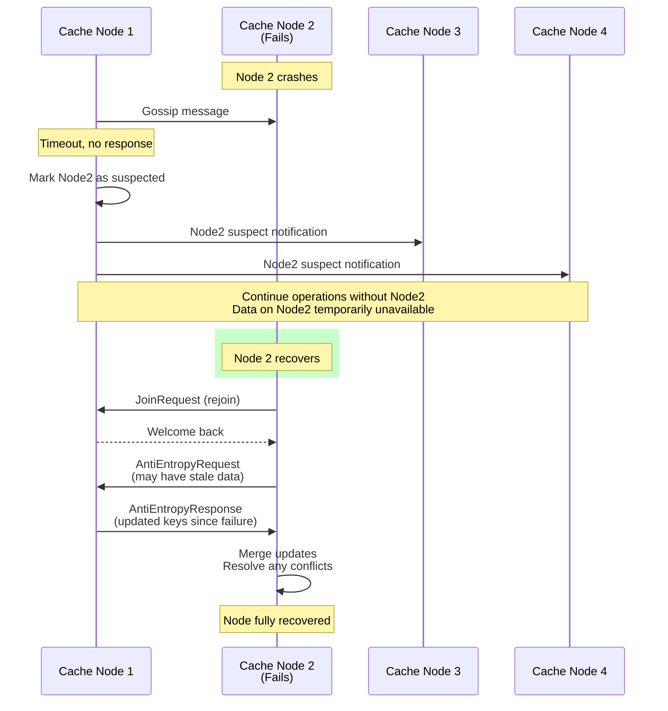

## 11. TTL-Based Expiration

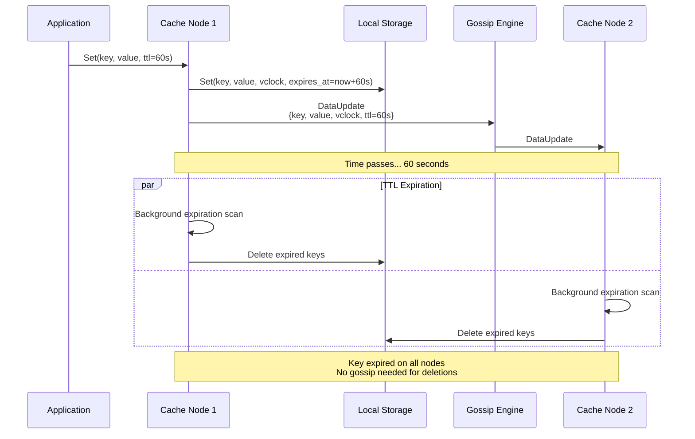

## 12. Explicit Delete Operation

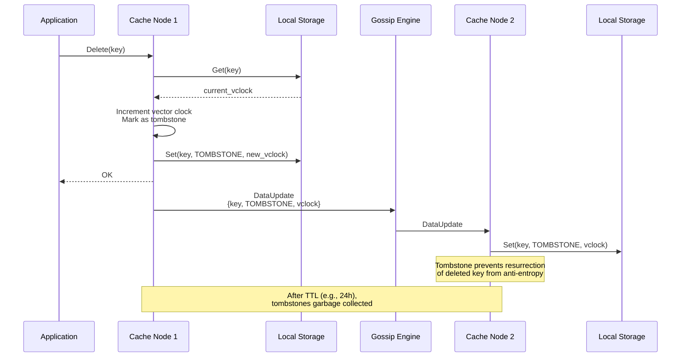

## Key Characteristics

**Independent Mode Trade-offs:**
- ✅ Zero external dependencies
- ✅ Lower operational complexity
- ✅ Fast writes (no backing store latency)
- ✅ High availability during partitions
- ⚠️ Higher gossip bandwidth (full data)
- ⚠️ Limited by node memory (no backing store)
- ⚠️ Data loss if all replicas lost
- ⚠️ Conflicts require resolution logic

**Design Considerations:**
1. **Vector Clocks**: Accurate conflict detection requires maintaining clocks
2. **Conflict Resolution**: Must be deterministic across all nodes
3. **Tombstones**: Necessary to prevent deleted data resurrection
4. **Anti-Entropy**: Critical for healing partitions and new nodes
5. **Data Size**: Keep values small since gossip carries full data
6. **Replication Factor**: Ensure enough nodes for desired durability

**Best Use Cases:**
- Session storage
- Feature flags
- Service discovery
- Distributed rate limiting
- Configuration caching
- Ephemeral shared state
