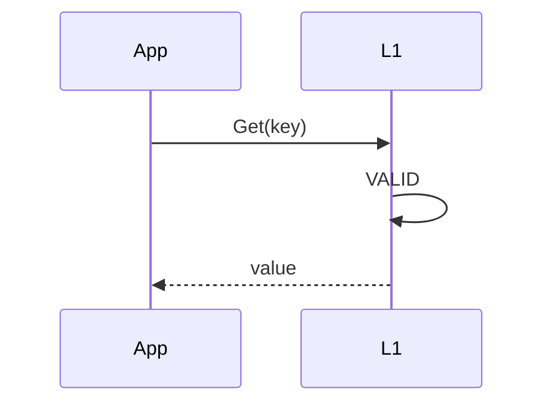
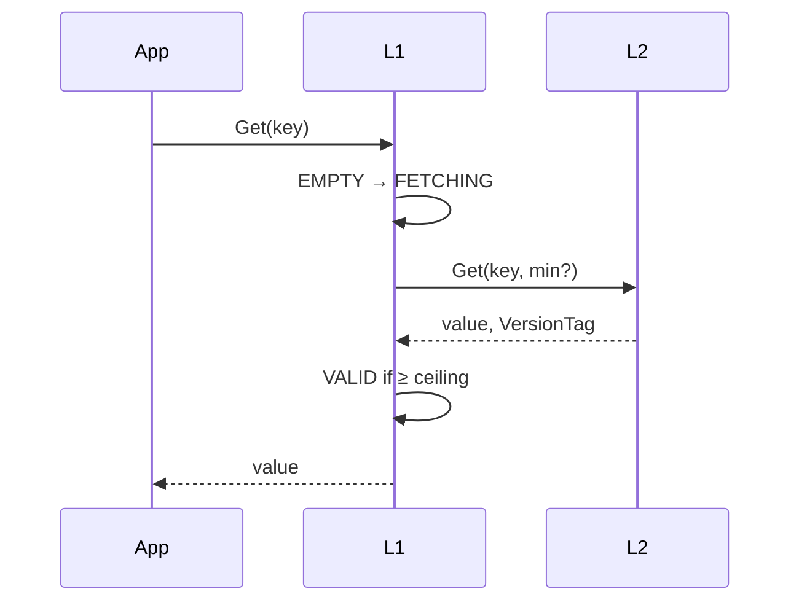
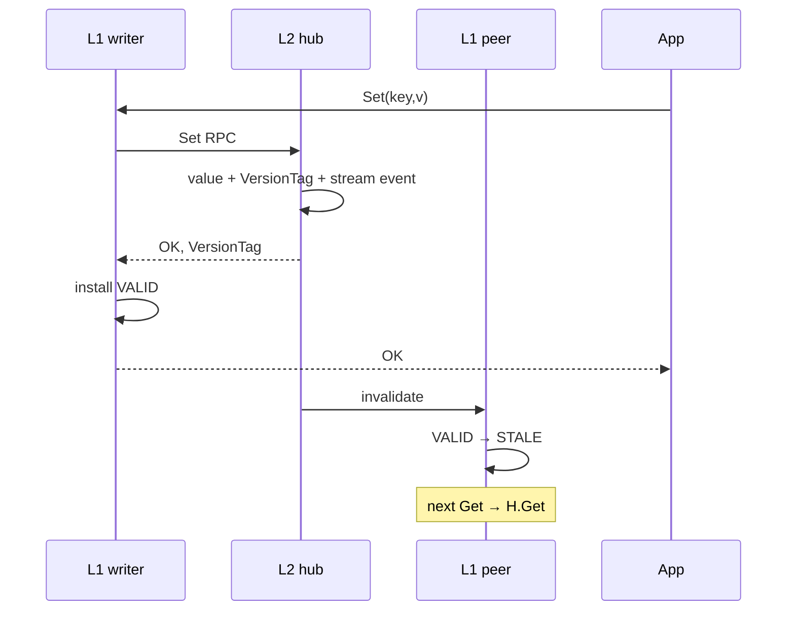
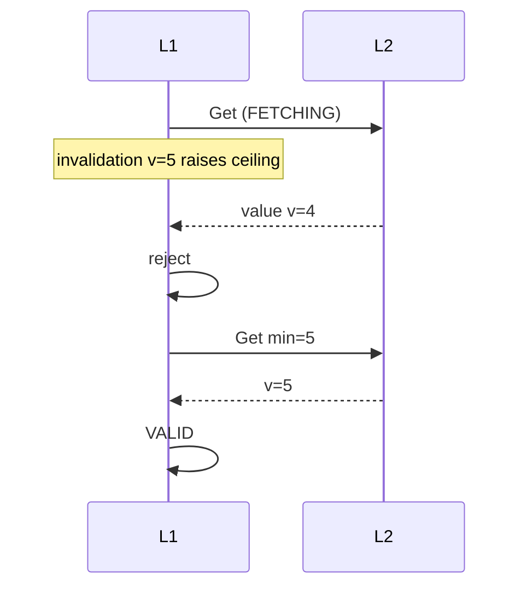
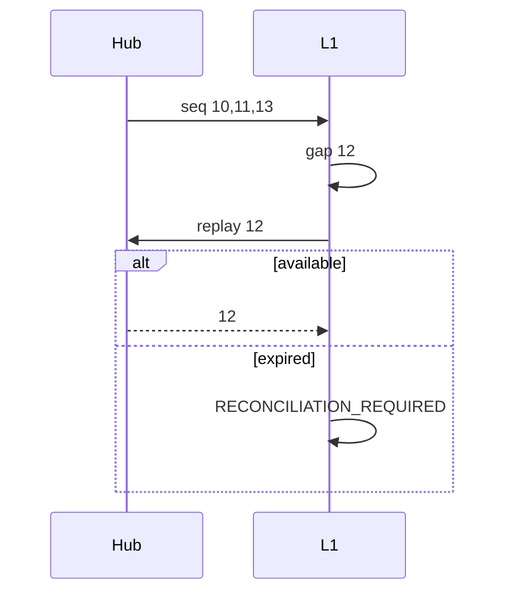
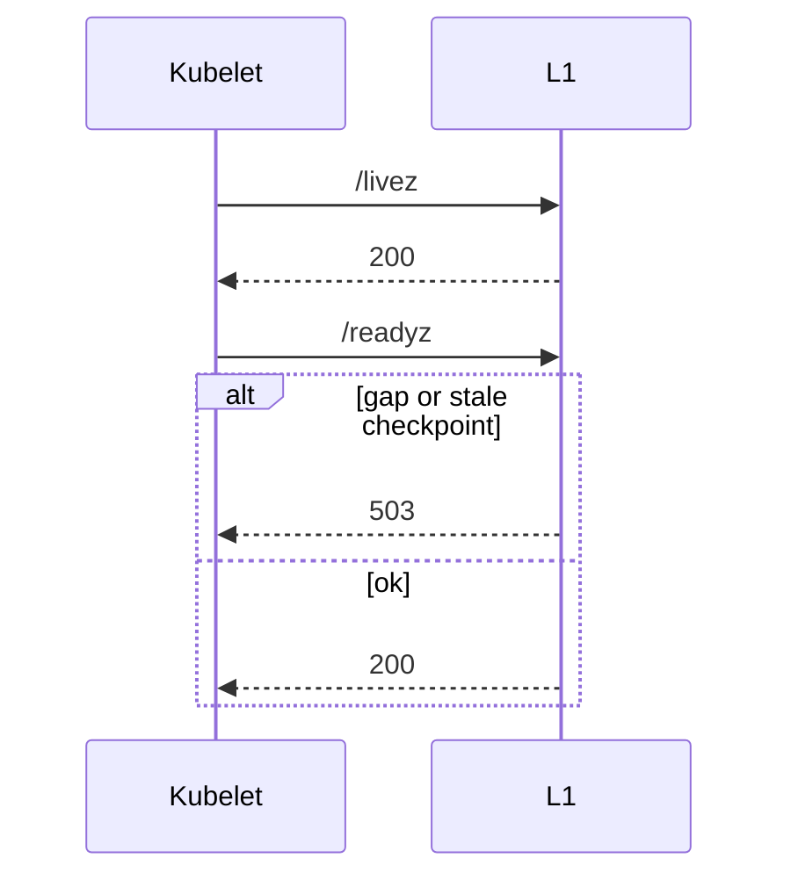

# Sequences (v1 hybrid)

Normative rules: [../SEMANTICS.md](../SEMANTICS.md).

## Components

```text
App → L1 (state machine, singleflight)
        ├─ hit → local
        ├─ miss/write → L2 hub RPC
        └─ invalidation stream ← hub (subscribers of shard)
```

## Read hit



## Read miss



## Write (W = 0 default)



## Write with W &gt; 0 (hub-aggregated)

```mermaid
sequenceDiagram
    participant A as L1 writer
    participant H as L2 hub
    participant B as L1 peer

    App->>A: Set(..., W=1)
    A->>H: Set RPC (W=1 in request)
    H->>H: durable commit first
    H->>B: invalidate
    B->>B: apply if slot exists
    B-->>H: InvalidateConfirm (node_id dedup)
    Note over H: wait until W distinct nodes
    H-->>A: OK + VersionTag (or timeout error; commit stands)
    A->>A: install VALID (even on confirm timeout)
    A-->>App: OK or ErrWriteConfirmTimeout
```

## Fetch vs invalidation race



## Stream gap / freshness



Silent stall (no checkpoints) → `/readyz` **STREAM_FRESHNESS_UNKNOWN**.

## Readiness


